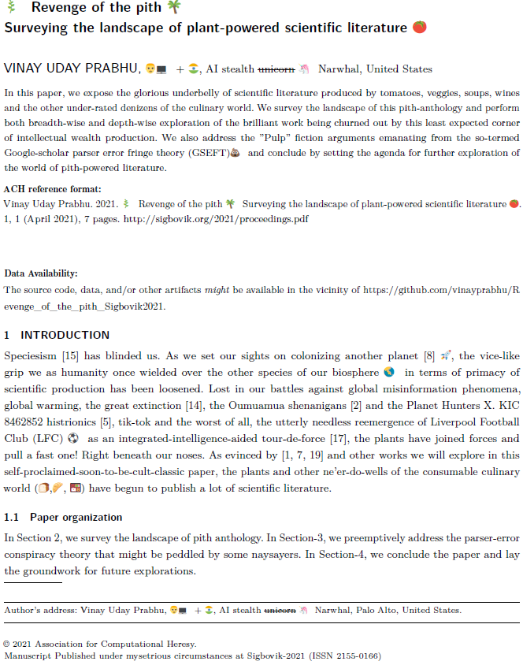

# Revenge of the pith @ Sigbovik-2021
Proccedings link: http://sigbovik.org/2021/proceedings.pdf

So, after many rounds of acrimonious jousts with the ever-demanding SigBovik reviewer committee with their triple-blind review antics (http://sigbovik.org/2021/), this soon-to-be-cult-classic got accepted!
In order to pay lip-service to the reproducibility-goons (it was either this or extortion money), I decided to _”voluntarily”_ open source the data and the research materials that went into the paper. 

